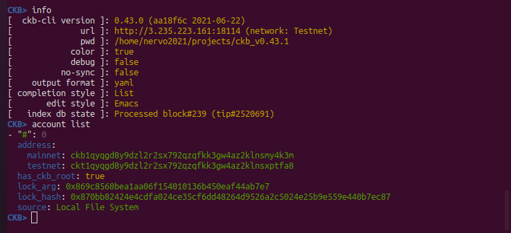
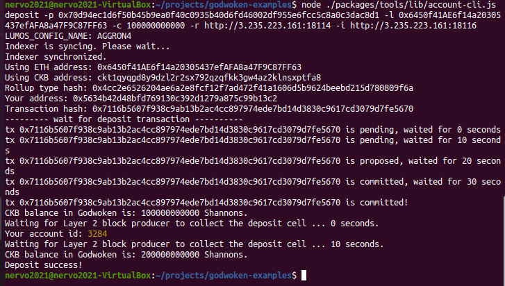
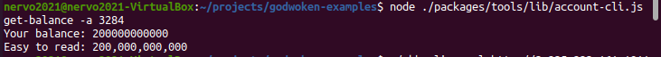

# A screenshot of the accounts created (account-list) in ckb-cli

# A link to the Layer 1 address you funded on the Testnet Explorer.

https://explorer.nervos.org/aggron/address/ckt1qyqgd8y9dzl2r2sx792qzqfkk3gw4az2klnsxptfa8

# A screenshot of the console output immediately after you have successfully submitted a deposit to Layer 2.

# Proof the transaction was a success!!!

